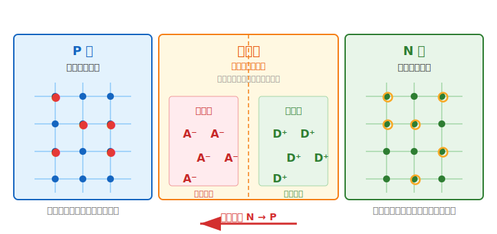
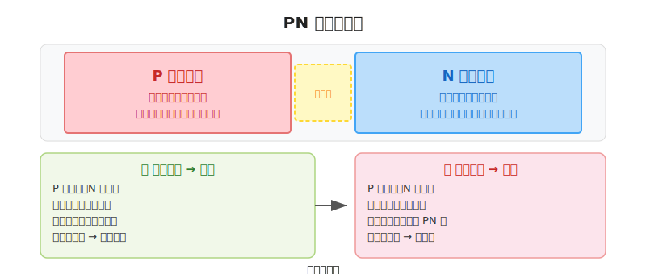
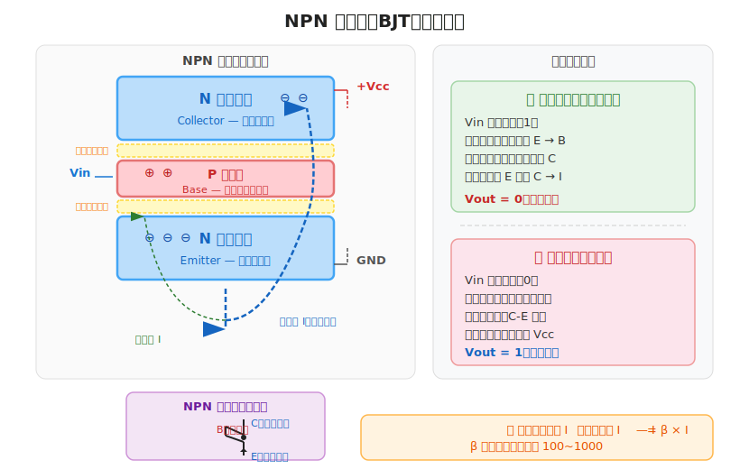
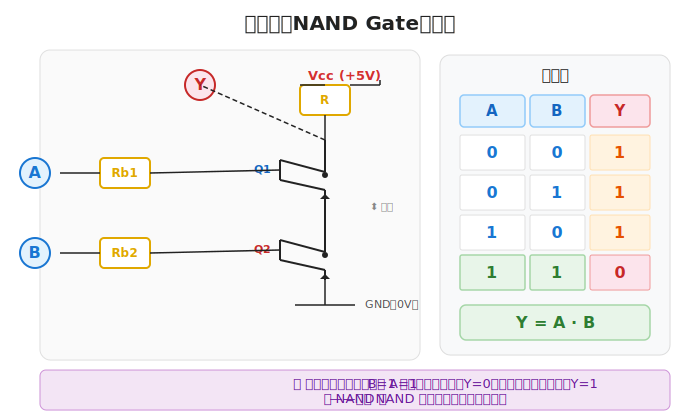
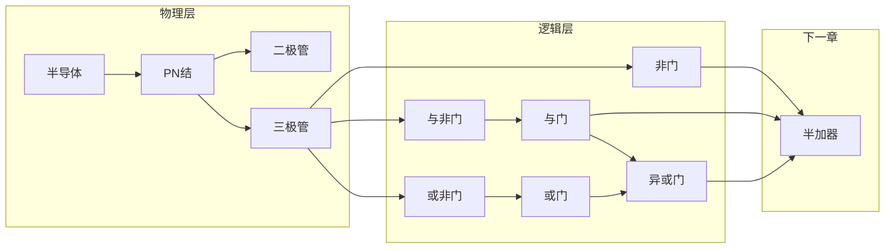

# 现代计算机底层基础

> 计算机最底层就干一件事：**控制电流的通和断**。
>
> 从沙子（硅）到逻辑门，这条路是：**半导体 → 二极管 → 三极管 → 逻辑门**。
>
> 一切的"计算"归根结底就是无数个"开/关"的组合。

---

## 一、半导体是啥？为啥用它？

**半导体（Semiconductor）** 这名字很直白——导电能力介于导体和绝缘体之间。

| 材料 | 导电性 | 举个栗子 |
|:----|:------|:---------|
| 导体 | 强 | 铜、铝、银 |
| 绝缘体 | 弱（几乎不导电） | 橡胶、塑料 |
| 半导体 | **可控**，这才是关键 | 硅（Si）、锗（Ge） |

> 💡 计算机芯片用的半导体主要是**硅**，原料就是沙子（SiO₂），提纯后得到。

### 本征半导体 ≈ 纯硅，不咋导电

纯硅晶体里，每个硅原子和周围 4 个硅原子手拉手（**共价键**），电子被绑得死死的，导电能力很弱。所以纯硅没啥用，得"掺点东西"才行。

### N 型半导体 → 多出自由电子

在纯硅里掺入**五价元素**（比如磷 P），磷有 5 个外层电子，但只和周围 4 个硅原子形成共价键，**多出来 1 个自由电子**：

```
    Si    Si    Si
     |     |     |
...— P  — Si — Si —...
     |     |     |
    Si    Si    Si
    ↑ 多一个自由电子（负电荷载流子）
```

- **多数载流子**：自由电子（带负电）
- 符号 **N** = Negative（负）

### P 型半导体 → 产生"空穴"

在纯硅里掺入**三价元素**（比如硼 B），硼只有 3 个外层电子，周围 4 个硅原子需要 4 个，结果**缺了一个电子**，形成一个"空穴"：

```
    Si    Si    Si
     |     |     |
...— B  — Si — Si —...
     |     |     |
    Si    Si    Si
    ↑ 少一个电子 → 空穴（可以理解为正电荷载流子）
```

- **多数载流子**：空穴（可以看作带正电）
- 符号 **P** = Positive（正）

> N 型就是电子太多溢出来了，P 型就是电子不够留了个坑。

---

## 二、PN 结 → 二极管的核心

把 P 型和 N 型半导体贴在一起，交界面就会形成 **PN 结**。这东西有个超有用的特性——**单向导电**。

### 单向导电性

```
      P ────┤  ├──── N
            PN 结

正向偏置（P 接正极，N 接负极）→ 导通 ✅
反向偏置（P 接负极，N 接正极）→ 截止 ❌
```

| 接法 | 结果 |
|:----|:-----|
| P 正、N 负（正向） | 导通，电流通过 |
| P 负、N 正（反向） | 截止，没电流 |

### 耗尽层是啥？为啥会形成？

刚把 P 和 N 贴一起时，交界面附近会发生扩散：

1. P 区的**空穴**（正电荷载流子）浓度高，向 N 区扩散
2. N 区的**自由电子**（负电荷载流子）浓度高，向 P 区扩散
3. 它们在交界处相遇并**复合**（正负抵消）

扩散走了一批载流子后，交界面两侧剩下的是**无法移动的固定离子**：

| 区域 | 发生了什么 | 剩下什么 |
|:----|:----------|:---------|
| **P 侧**（靠交界处） | 空穴跑掉了，留下带负电的**受主离子**（A⁻） | **负离子** |
| **N 侧**（靠交界处） | 电子跑掉了，留下带正电的**施主离子**（D⁺） | **正离子** |

这些固定正负离子组成的区域就是 **耗尽层（Depletion Layer，也叫空间电荷区）**——"耗尽"指的是这一带的可移动载流子（空穴和自由电子）都被耗光了，只剩下固定离子。



**耗尽层的要点**：
- 耗尽层内存在**内建电场**，方向从 **N→P**（从正离子指向负离子）
- 这个电场会**阻止多数载流子继续扩散**（把 P 侧空穴往 P 拉、N 侧电子往 N 拉），达到平衡
- 这个内建电场就是 PN 结**单向导电**的根本原因
- 耗尽层越宽，内建电场越强，阻挡能力越大

### 偏置怎么影响耗尽层？

| 接法 | 外电场方向 | 耗尽层怎么变 | 结果 |
|:----|:----------|:------------|:-----|
| **正向**（P 正、N 负） | 和内建电场相反 | **变窄** → 阻挡减弱 | ✅ 导通 |
| **反向**（P 负、N 正） | 和内建电场相同 | **变宽** → 阻挡增强 | ❌ 截止 |

> 记个口诀：**正向 = 外电场推着载流子往中间挤 → 耗尽层被挤窄 → 电流通过。反向 = 外电场拉着载流子往两边跑 → 耗尽层被拉宽 → 电流堵死。**

### 二极管符号



二极管其实就是 **PN 结 + 两个引脚**，记住电流只能从 **P（阳极）→ N（阴极）** 单向走，不能反过来。

---

## 三、三极管（BJT）—— 逻辑门的灵魂

三极管全名叫 **Bipolar Junction Transistor（双极性晶体管）**，名字不用记，知道它是逻辑门的核心元件就行。

### NPN 三极管长啥样？

三极管就是三层半导体夹在一起，像三明治：

```
       ↑ 接到 +Vcc（通过电阻）
       │
   ┌───┴───┐
   │ N 型   │  ← 集电区（Collector）— 收集载流子
   └───┬───┘
   ┌───┴───┐
   │ P 型   │  ← 基区（Base）— 超薄，控制核心
   └───┬───┘
   ┌───┴───┐
   │ N 型   │  ← 发射区（Emitter）— 发射载流子
   └───┬───┘
       │
       ↓ 接到 GND
```

三个区域引出三个引脚：**发射极（E）**、**基极（B）**、**集电极（C）**。

### 三极管咋当开关用？

三极管内部有两个 PN 结：**发射结**（E-B 之间）和**集电结**（C-B 之间）。



| 基极输入 | 发射结 | 集电结 | 三极管状态 | C-E 之间 |
|:--------:|:------:|:------:|:----------:|:--------:|
| 高电平（1） | **正偏** | **反偏** | 饱和导通 | 近似短路（0V） |
| 低电平（0） | 反偏 | — | 截止 | 断开 |

> **导通的原理**：Vin=1 时发射结正偏，电子从发射区冲进基区。因为基区做得特别薄，大部分电子根本来不及和空穴复合，直接穿过去跑到集电区，形成电流 I<sub>C</sub>。这就是传说中的"**小电流控制大电流**"，一切逻辑门的基础。

**三极管就是一个电压控制的开关**——基极给个高电平，C-E 就通了；给低电平，C-E 就断了。

---

## 四、用三极管搭逻辑门

### 1️⃣ 非门（NOT Gate）—— 最简单的门

**结构**：1 个三极管 + 1 个上拉电阻


| A（输入） | 三极管 | Y（输出） |
|:---------:|:------:|:---------:|
| 0（低电平） | 截止 | 1（高电平，Vcc） |
| 1（高电平） | 导通 | 0（低电平，GND） |

**表达式**：$Y = \overline{A}$

> **工作原理**：A=1 时三极管导通，输出被拉到 GND（0）；A=0 时三极管截止，输出被电阻拉到 Vcc（1）。所以叫"非门"——**输出和输入反着来**。

---

### 2️⃣ 与非门（NAND Gate）

**结构**：2 个三极管**串联** + 1 个上拉电阻



| A | B | 三极管状态 | Y（输出） |
|:-:|:-:|:----------:|:---------:|
| 0 | 0 | 都截止 | 1 |
| 0 | 1 | Q1 截止，Q2 导通 | 1 |
| 1 | 0 | Q1 导通，Q2 截止 | 1 |
| 1 | 1 | 都导通 | 0 |

**表达式**：$Y = \overline{A \land B}$

> 记住：**只有 A 和 B 同时为 1，两个三极管才都导通，输出才是 0。** 其他情况输出都是 1。因为是"与"的结果取反，所以叫"与非"。

---

### 3️⃣ 或非门（NOR Gate）

**结构**：2 个三极管**并联** + 1 个上拉电阻


| A | B | 三极管状态 | Y（输出） |
|:-:|:-:|:----------:|:---------:|
| 0 | 0 | 都截止 | 1 |
| 0 | 1 | Q1 截止，Q2 导通 | 0 |
| 1 | 0 | Q1 导通，Q2 截止 | 0 |
| 1 | 1 | 都导通 | 0 |

**表达式**：$Y = \overline{A \lor B}$

> 只要 A **或** B 有一个为 1，就有一个三极管导通，输出就是 0。**只有两个都是 0 时输出才是 1。** 和"或"反着来，所以叫"或非"。

---

### 4️⃣ 其他门咋来？

**NAND 和 NOR 被称为"通用门"**——只用其中一种就能组合出所有其他门：

```
非门   NOT  = NAND(A, A)           = NOR(A, A)
与门   AND  = NOT(NAND(A, B))
或门   OR   = NOT(NOR(A, B))
异或门 XOR  = AND(NAND(A,B), OR(A,B))
```

> 这就是为什么芯片厂经常只生产一种门（比如全用 NAND），成本低还能搭一切。**一个 NAND 打天下。**

---

## 五、速查表

| 名称 | 布尔表达式 | 逻辑符号 | 三极管实现 |
|:----|:----------|:--------:|:----------:|
| NOT | $\overline{A}$ | !A | 1 个三极管 |
| AND | $A \land B$ | A·B | NAND + NOT |
| OR | $A \lor B$ | A+B | NOR + NOT |
| NAND | $\overline{A \land B}$ | !(A·B) | 2 个三极管串联 |
| NOR | $\overline{A \lor B}$ | !(A+B) | 2 个三极管并联 |
| XOR | $A \oplus B$ | A⊕B | 多个门组合 |

---

## 六、总结一下

从物理到逻辑的路线：



**核心就一句话**：半导体 → 控制电子流动 → 做成开关（三极管）→ 拼成逻辑门 → 组合出计算功能。

下一步就是用这些逻辑门搭 **半加器**，开始真正的二进制计算 🚀
