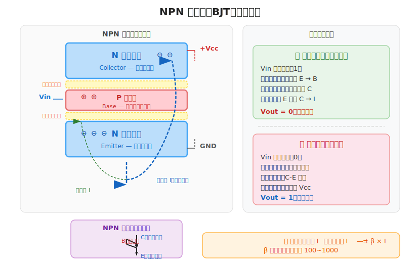
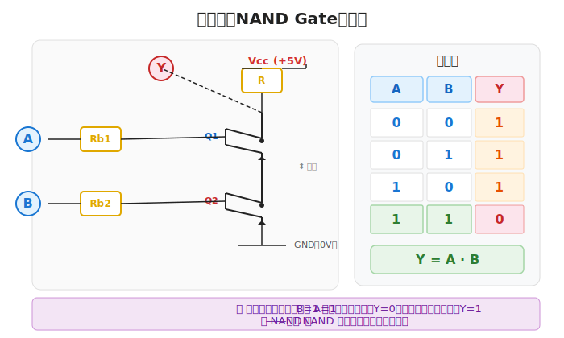
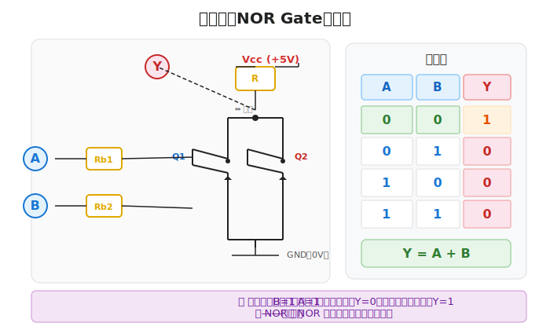
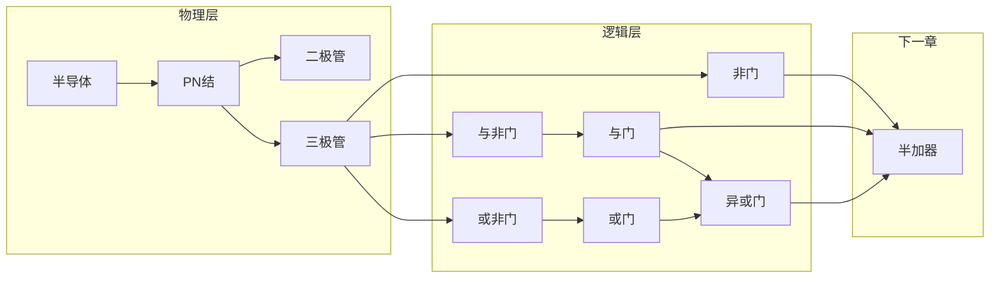

# 半导体与逻辑门

> 计算机最底层的基础：**半导体 → 二极管 → 三极管 → 逻辑门**。
>
> 一切计算都由最基础的"开"和"关"组合而来。

---

## 一、什么是半导体

**半导体（Semiconductor）** 的导电能力介于导体和绝缘体之间。

| 材料 | 导电性 | 举例 |
|:----|:------|:-----|
| 导体 | 强 | 铜、铝、银 |
| 绝缘体 | 弱（几乎不导电） | 橡胶、塑料 |
| 半导体 | **可控** | 硅（Si）、锗（Ge） |

> 💡 **硅**是计算机芯片最常用的半导体材料，沙子（SiO₂）提纯后可得。

### 本征半导体

纯硅晶体中，每个硅原子与周围 4 个硅原子形成**共价键**，电子被束缚，导电能力很弱。

### N 型半导体

在纯硅中掺入**五价元素**（如磷 P），多出一个自由电子：

```
    Si    Si    Si
     |     |     |
...— P  — Si — Si —...
     |     |     |
    Si    Si    Si
    ↑ 多一个自由电子（负电荷载流子）
```

- **多数载流子**：自由电子（负电荷）
- 符号：**N**（Negative）

### P 型半导体

在纯硅中掺入**三价元素**（如硼 B），产生一个"空穴"：

```
    Si    Si    Si
     |     |     |
...— B  — Si — Si —...
     |     |     |
    Si    Si    Si
    ↑ 少一个电子 → 空穴（正电荷载流子）
```

- **多数载流子**：空穴（正电荷）
- 符号：**P**（Positive）

---

## 二、PN 结与二极管

将 **P 型** 和 **N 型** 半导体紧贴在一起，交界面形成 **PN 结**。

### 单向导电性

```
      P ────┤  ├──── N
            PN 结

正向偏置（P 接正极，N 接负极）→ 导通 ✓
反向偏置（P 接负极，N 接正极）→ 截止 ✗
```

| 偏置方式 | 结果 |
|:---------|:-----|
| P 正、N 负（正向） | 导通，电流流过 |
| P 负、N 正（反向） | 截止，无电流 |

### 什么是耗尽层？

当 P 型和 N 型半导体刚接触时，交界面会发生一件有趣的事：

1. P 区边界附近的**空穴**（正电荷）向 N 区扩散
2. N 区边界附近的**自由电子**（负电荷）向 P 区扩散
3. 它们在中间相遇并**复合**（抵消），形成一个既无空穴也无自由电子的区域

这个**没有载流子的区域**就叫 **耗尽层（Depletion Layer）**，也叫**空间电荷区**。

```
      P 型         耗尽层         N 型
  ┌──────────┐ ════════╗ ┌──────────┐
  │ 空穴很多  │ ║ 无载流子 ║ │ 电子很多  │
  │          │ ║ 只有正负 ║ │          │
  │  ●  ●  ● │ ║ 离子对 ║ │  ○  ○  ○ │
  └──────────┘ ╚════════╝ └──────────┘
    正电荷          ⬆         负电荷
              内建电场方向
```

**耗尽层的作用**：
- 它内部存在一个**内建电场**（P→N 方向），阻止载流子继续扩散
- 这个电场就是 PN 结**单向导电**的根本原因
- 耗尽层越宽，阻挡能力越强

### 偏置对耗尽层的影响

| 偏置方式 | 外电场方向 | 耗尽层变化 | 结果 |
|:---------|:----------|:-----------|:-----|
| **正向**（P 正、N 负） | 与内建电场相反 | **变窄** → 阻挡减弱 | ✅ 导通 |
| **反向**（P 负、N 正） | 与内建电场相同 | **变宽** → 阻挡增强 | ❌ 截止 |

> **记忆口诀**：正向偏置 = 外电场推着载流子往中间挤 → 耗尽层被"挤窄" → 电流通过。反向偏置 = 外电场拉着载流子往两边跑 → 耗尽层被"拉宽" → 电流阻断。

### 二极管符号


二极管 = **PN 结 + 引脚**，电流只能从 **P（阳极）→ N（阴极）** 单向流通。

---

## 三、三极管（BJT）作为开关

三极管（Bipolar Junction Transistor，双极性晶体管）是逻辑门的核心元件。

### NPN 三极管结构

三极管由三层半导体交替组成，像"三明治"一样：

```
       ↑ 接到 +Vcc（通过电阻）
       │
   ┌───┴───┐
   │ N 型   │  ← 集电区（Collector）— 收集载流子
   └───┬───┘
   ┌───┴───┐
   │ P 型   │  ← 基区（Base）— 很薄，控制核心
   └───┬───┘
   ┌───┴───┐
   │ N 型   │  ← 发射区（Emitter）— 发射载流子
   └───┬───┘
       │
       ↓ 接到 GND
```

三个区域引出三个引脚：**发射极（E）**、**基极（B）**、**集电极（C）**。

### 三极管的开关原理

三极管内部存在两个 PN 结：**发射结**（E-B 之间）和**集电结**（C-B 之间）。



| 基极输入 | 发射结 | 集电结 | 三极管状态 | C-E 之间 |
|:--------:|:------:|:------:|:----------:|:--------:|
| 高电平（1） | **正偏** | **反偏** | 饱和导通 | 近似短路（0V） |
| 低电平（0） | 反偏 | — | 截止 | 断开 |

> **导通原理**：Vin=1 时发射结正偏，电子从发射区注入基区；由于基区极薄，大部分电子直接穿过到达集电区，形成集电极电流 I<sub>C</sub>。这叫"**小电流控制大电流**"，是一切逻辑门的基础。

---

## 四、用三极管搭建基本逻辑门

### 1️⃣ 非门（NOT Gate）

**结构**：一个三极管 + 一个上拉电阻


| A（输入） | 三极管 | Y（输出） |
|:---------:|:------:|:---------:|
| 0（低电平） | 截止 | 1（高电平，Vcc） |
| 1（高电平） | 导通 | 0（低电平，GND） |

**逻辑表达式**：$Y = \overline{A}$

> **工作原理**：A 为 1 时三极管导通，输出拉到 GND（0）；A 为 0 时三极管截止，输出被电阻拉到 Vcc（1）。这叫"**反相**"。

---

### 2️⃣ 与非门（NAND Gate）

**结构**：两个三极管**串联** + 一个上拉电阻



| A | B | 三极管状态 | Y（输出） |
|:-:|:-:|:----------:|:---------:|
| 0 | 0 | 都截止 | 1 |
| 0 | 1 | Q1 截止，Q2 导通 | 1 |
| 1 | 0 | Q1 导通，Q2 截止 | 1 |
| 1 | 1 | 都导通 | 0 |

**逻辑表达式**：$Y = \overline{A \land B}$

> **关键**：只有 A **且** B 都为 1，两个三极管才都导通，输出才为 0。这与"与"相反，所以叫"**与非**"。

---

### 3️⃣ 或非门（NOR Gate）

**结构**：两个三极管**并联** + 一个上拉电阻



| A | B | 三极管状态 | Y（输出） |
|:-:|:-:|:----------:|:---------:|
| 0 | 0 | 都截止 | 1 |
| 0 | 1 | Q1 截止，Q2 导通 | 0 |
| 1 | 0 | Q1 导通，Q2 截止 | 0 |
| 1 | 1 | 都导通 | 0 |

**逻辑表达式**：$Y = \overline{A \lor B}$

> **关键**：只要 A **或** B 有一个为 1，就有一个三极管导通，输出为 0。只有 A 且 B 都为 0 时输出才为 1。这是"或"的反相，叫"**或非**"。

---

### 4️⃣ 其他门的构建

有了 **NAND** 和 **NOR** 这两个**通用门**，可以组合出所有其他门：

```
非门   NOT  = NAND(A, A)         = NOR(A, A)
与门   AND  = NOT(NAND(A, B))
或门   OR   = NOT(NOR(A, B))
异或门 XOR  = AND(NAND(A,B), OR(A,B))
```

> **通用门**：只用 NAND（或只用 NOR）就能搭出所有逻辑门，因此芯片制造中常只生产一种门，降低成本。

---

## 五、逻辑门符号速查

| 名称 | 布尔表达式 | 逻辑符号 | 三极管实现 |
|:----|:----------|:--------:|:----------:|
| NOT | $\overline{A}$ |  | 1 个三极管 |
| AND | $A \land B$ | A·B | NAND + NOT |
| OR | $A \lor B$ | A+B | NOR + NOT |
| NAND | $\overline{A \land B}$ | !(A·B) | 2 个三极管串联 |
| NOR | $\overline{A \lor B}$ | !(A+B) | 2 个三极管并联 |
| XOR | $A \oplus B$ | A⊕B | 多个门组合 |

---

## 六、总结



从这里出发，下一步就是用这些逻辑门搭建 **半加器**，开始真正的计算 🚀
