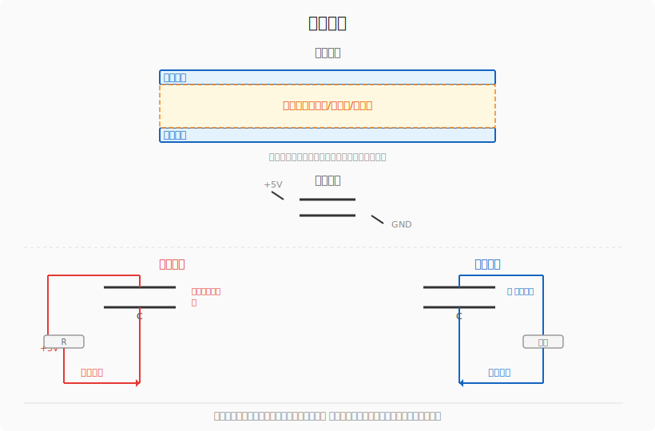

# 电容 — 为什么它能"记住"电荷？

> 内存里的每个 bit 说到底就是个微小的电容，靠**有没有电荷**来区分 0 和 1。

---

## 一、电容原理

电容的结构极简：**两块金属板中间夹一层绝缘体**。



| 状态 | 发生了什么 |
|:----|:----------|
| **充电** | 接电源正极 → 电子被拉到上极板 → 上极板带负电，下极板缺电子带正电 → 极板间形成电场 |
| **放电** | 接通负载 → 电子从下极板经负载流回上极板 → 电场消失 |
| **隔直** | 中间是绝缘体，电子不能穿过，所以直流电流不能通过（但交流信号可以通过电场传递） |

> 电容就是**一个装电荷的小桶**：充电就是往桶里倒水（存电荷），放电就是把水倒出来（释放电荷）。桶能装多少水，看电容的容量 C。

---

## 二、电容的单位

电容的基本单位是 **法拉（F）**，但 1 法拉巨大无比，实际电路中常用的是微法、纳法、皮法：

| 单位 | 符号 | 换算 | 用途举例 |
|:----|:----|:-----|:---------|
| 法拉 | F | 1 F | 超级电容、电源滤波 |
| 毫法 | mF | 10⁻³ F | 大功率滤波 |
| **微法** | **μF** | 10⁻⁶ F | 电源去耦、电解电容最常见 |
| **纳法** | **nF** | 10⁻⁹ F | 高频滤波、振荡电路 |
| **皮法** | **pF** | 10⁻¹² F | 晶振负载、高频调谐 |

### 1 法拉实际上有多大？

1 法拉 = 用 1A 电流充电 1 秒，两端电压升高 1V：

$$ 1\ F = \frac{1\ A \cdot 1\ s}{1\ V} $$

| 对比对象 | 容量 |
|:--------|:----|
| 普通电解电容 | 100~470 μF |
| 电脑主板滤波电容 | 1000~4700 μF |
| 音响大水塘电容 | 10000 μF（0.01 F） |
| 1 法拉超级电容 | 拇指大小，能存电很久 |
| 汽车启动超级电容 | 100~3000 F |

面包板上常用的 100 μF 电解电容，就是 **0.0001 F**——1 法拉的万分之一。

**实物识别：** 电解电容（大个头、有正负极）通常标 μF；瓷片电容（小圆片）通常标 nF 或 pF。瓷片上的数字如 `104` 表示 10×10⁴ pF = 100 nF。

---

## 三、RC 时间常数——充电要多快？

充电速度取决于 **RC 时间常数**：

$$ \tau = R \times C $$

- $\tau$ = 时间常数（秒）
- $R$ = 串联电阻（Ω）
- $C$ = 电容容量（F）

| 时间 | 充到百分比 | 说明 |
|:---:|:---------:|:----|
| 1τ | 63% | 一个时间常数 |
| 2τ | 86% | |
| **3τ** | **95%** | **工程上认为基本充满** |
| 5τ | 99%+ | 完全充满 |

### 计算举例

**1kΩ + 100μF：** $\tau = 1000 \times 0.0001 = 0.1\ s$，3τ = 0.3 s 充满

**10kΩ + 470μF：** $\tau = 10000 \times 0.00047 = 4.7\ s$，3τ ≈ 14 s 充满

**1MΩ + 1μF：** $\tau = 1,000,000 \times 0.000001 = 1\ s$，3τ = 3 s 充满

> 电阻越大或电容越大，充放电越慢。电阻限制电流大小，电容大了需要更多电荷才能充满。

---

## 四、实物实验：RC 充放电

一个简单的面包板电路来验证上面的计算：

```
充电回路：Vcc ── 开关1 ── 1MΩ ──┬── 4.7μF ── GND
                                   │
放电回路：                         └── 开关2 ── 1kΩ ── LED ── GND
```

### 操作步骤

1. 断开两个开关，初始状态电容两端电压为 0
2. 闭合开关1：Vcc 经 1MΩ 给 4.7μF 充电，τ ≈ 4.7 s，约 **14 秒**基本充满
3. 断开开关1，闭合开关2：电容储存的电荷经 1kΩ + LED 释放

### 实测现象


- **放电瞬间**：LED 极快地闪一下就灭（4.7μF + 1kΩ 的 τ ≈ 4.7 ms，肉眼只能看到一个闪点）
- **想看到渐灭效果**：把电容换成 100μF 以上，或把放电电阻换成 10kΩ（但 LED 会暗很多）

---

## 五、电容在记忆电路中的作用

动态存储器（DRAM）中，每个 bit 就是一个微小电容 + 一个晶体管：

- **写入**：给电容充电（存 1）或放电（存 0）
- **读取**：检测电容有没有电荷
- **刷新**：电容会缓慢漏电，需要定期重新充电，这就是 DRAM "刷新"的由来

> 电容会漏电，断电后数据就丢了——这是**易失性存储器**。SR 锁存器虽然也是易失的，但它不需要刷新（只要供电就一直维持状态）。DRAM 用更少的晶体管（1T1C vs 6 个晶体管）换来更高的密度，但需要额外的刷新电路。
这会在后面的章节中具体展开。
