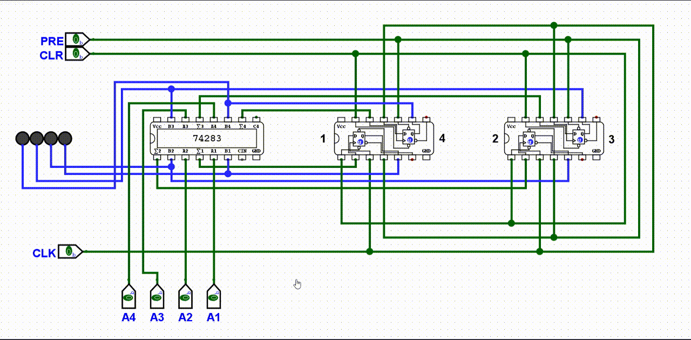
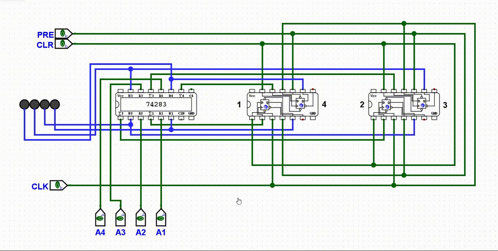
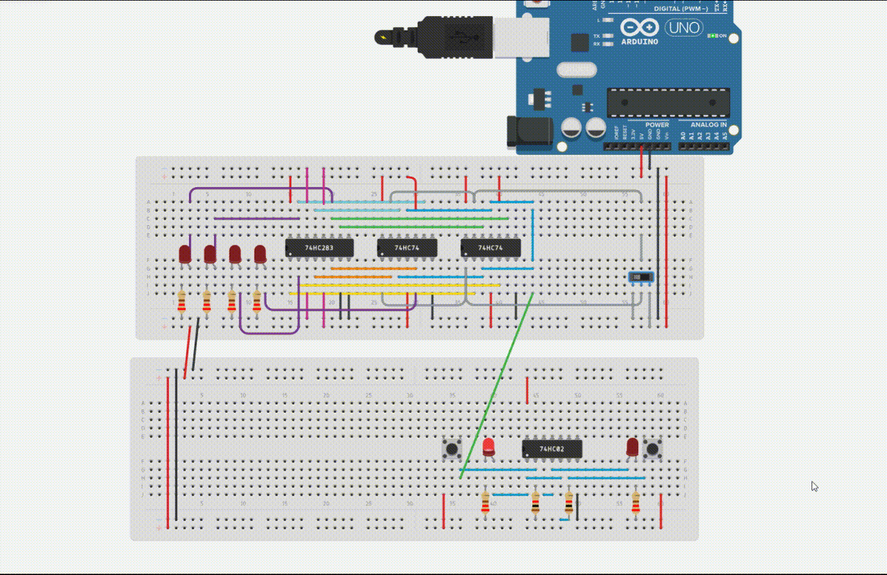

# 具有记忆的加法器（累加器）

第二章搭的加法器是组合逻辑——加数一换，上次的和就丢了。第三章讲了存储电路。这一节把两者合起来，做一个**能记住结果的 4 位累加器**。

之前用面包板搭全加器和触发器，器件太多太乱。原理搞懂之后，直接用现成的芯片：**74LS283**（4 位加法器）和 **74LS74**（双 D 触发器）。


> 74LS74 的 CLR 是清零（Clear），PRE 是预置 1（Preset）。它们都是**低电平有效**——接 0 才触发，接 1 表示不用。正常工作时 PRE 必须一直接 VCC。

## 工作原理

```
  A[3:0] = 0001（固定）      B[3:0] ← Q[3:0]（上次结果反馈回来）
         │                           │
         └───────┬───────────────────┘
                 │
            ┌────▼────┐
            │ 74LS283 │──── Σ[3:0] ──→ D[3:0] ──→ 74LS74 ×2 ──→ Q[3:0] ──→ LED
            │  C0=GND │                                    │
            └─────────┘                                    │
                 ▲                                         │
                 └─────────────────────────────────────────┘
                          反馈回路
```

一个加数固定为 0001，另一个加数是上次加法的和。每次时钟上升沿，结果被锁存，然后反馈回去参与下一轮加法。效果就是：**1, 2, 3, 4, 5... 一直在累加**。

> 下标数字小的是低位，输出结果左边是高位、右边是低位。

## Logisim 仿真

先画电路图验证逻辑。加数 A 固定为 0001，手动开关模拟时钟：

**1+1+1+1...**



**1+3+7=11**



## Tinkercad 面包板搭建

在面包板上实际搭出来，更接近真实电路：

- 74LS283 A[3:0] = 0001，C0 接地
- 74LS283 B[3:0] ← 74LS74 Q[3:0]
- 4 个 PRE 全部接 VCC，4 个 CLR 串联后默认接 VCC（加一个清零按钮）
- 4 个 LED 通过 220Ω 电阻接 Q[3:0]
- 用 SR 锁存器做去抖，产生干净的时钟脉冲

**1+1+1+1...**


