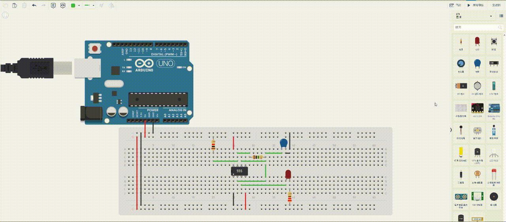
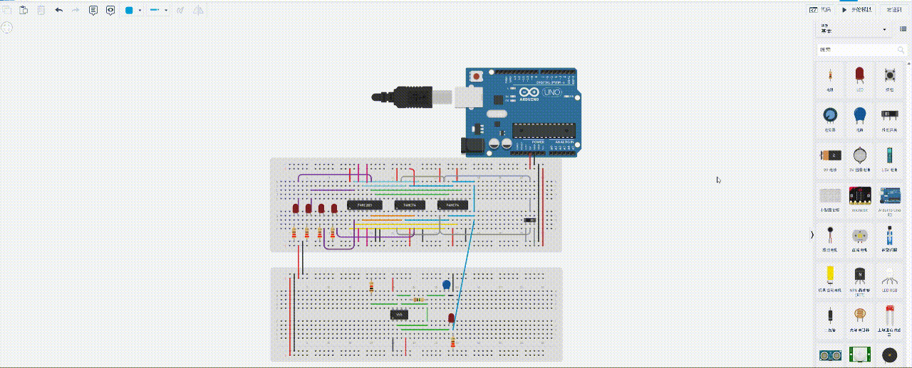

# 555 定时器 — 自动产生时钟信号

> 上节用开关手动触发加法器的时钟，每次算一个数都得按一下。555 定时器能**自己振荡出高低交替的方波**，后面就可以用它驱动加法器自动累加了。

---

## 一、555 内部结构

555 芯片内部简化后，其实并不复杂：三个均压电阻 + 两个电压比较器 + 一个 RS 触发器 + 一个放电三极管。


- pin8 接 Vcc、pin1 接 GND，中间串联 3 个**相同电阻**分压 → 得到 $\frac{1}{3}V_{cc}$ 和 $\frac{2}{3}V_{cc}$ 两个参考电压（当前环境 5V，即约 1.67V 和 3.33V）
- 下方比较器：同相端接 $\frac{1}{3}V_{cc}$，反相端接 pin2（触发） → **pin2 < 1.67V 输出高、> 1.67V 输出低**
- 上方比较器：同相端接 pin6（阈值），反相端接 $\frac{2}{3}V_{cc}$ → **pin6 > 3.33V 输出高、< 3.33V 输出低**
- RS 触发器：下方比较器连 S 端，上方连 R 端
- Q非输出经反相后到 pin3（输出脚），Q 非还控制一个三极管开关 → 导通时把 pin7（放电脚）拉到 GND
- pin4 是低电平有效的复位脚（接 Vcc 表示不复位）
- pin5 是控制电压脚，可以外部调节参考电压，**正常用时悬空**或接 10nF 电容到 GND

## 二、外部接线（无稳态模式）


```
Vcc ── R1 ──┬── R2 ──┬── pin2/6
            │        │
          pin7      C1
                      │
                     GND
```

- pin8、pin4 → Vcc
- pin1 → GND
- R1 从 Vcc → pin7（放电脚）
- R2 从 pin7 → pin2/6（触发/阈值短接）
- C1 从 pin2/6 → GND
- pin3 → 输出（接 LED）

> **pin5 悬空**！之前 Tinkercad 里 pin5 接了 GND 导致不输出，断开就好了。

## 三、振荡过程

| 阶段 | C1 电压 | 下方比较器(S) | 上方比较器(R) | RS 状态 | pin3 Q | pin7 放电管 |
|:----|:-------|:------------|:------------|:------|:------|:----------|
| ①上电 | 0V | 高 | 低 | **S=1,R=0→Set** | **1** | 断开 |
| 充电中 | 1.67V~3.33V | 低 | 低 | **S=0,R=0→保持** | **1** | 断开 |
| 充到顶 | >3.33V | 低 | 高 | **S=0,R=1→Reset** | **0** | **导通，C1 放电** |
| 放电中 | 3.33V→1.67V | 低 | 低 | **S=0,R=0→保持** | **0** | 导通 |
| ①放到底 | <1.67V | 高 | 低 | **S=1,R=0→Set** | **1** | 断开，重新充电 |
| ②充电中 | 1.67V~3.33V | 低 | 低 | **S=0,R=0→保持** | **1** | 断开 |
| ②充到顶 | >3.33V | 低 | 高 | **S=0,R=1→Reset** | **0** | **导通，C1 放电** |
| ②放电中 | 3.33V→1.67V | 低 | 低 | **S=0,R=0→保持** | **0** | 导通 |
| ②放到底 | <1.67V | 高 | 低 | **S=1,R=0→Set** | **1** | 断开，重新充电 |
| ③充电中 | 1.67V~3.33V | 低 | 低 | **S=0,R=0→保持** | **1** | 断开 |
| ③充到顶 | >3.33V | 低 | 高 | **S=0,R=1→Reset** | **0** | **导通，C1 放电** |
| ··· | ··· | ··· | ··· | 循环往复 | **0↔1** | 通↔断 |

然后就一直循环，pin3 输出 0→1→0→1...... 的方波。

> C1 实际上在 $\frac{1}{3}V_{cc}$ 到 $\frac{2}{3}V_{cc}$ 之间充放，不是 0V 到 5V。

## 四、频率计算

| 参数 | 公式 |
|:----|:----|
| 充电时间（Q=1） | $T_{high} = 0.693 \times (R_1 + R_2) \times C_1$ |
| 放电时间（Q=0） | $T_{low} = 0.693 \times R_2 \times C_1$ |
| 周期 | $T = T_{high} + T_{low}$ |
| 频率 | $f = 1 / T$ |
| 占空比 | $\frac{R_1+R_2}{R_1+2R_2}$（>50% 无法到 50%） |

**要让高低电平时间接近相等，需要 $R_2 \gg R_1$**。

举例：R1=1kΩ, R2=1MΩ, C1=1μF
- $T_{high} = 0.693 \times 1,001,000 \times 0.000001 \approx 0.69\ s$
- $T_{low} = 0.693 \times 1,000,000 \times 0.000001 \approx 0.69\ s$
- $T \approx 1.38\ s$，$f \approx 0.72\ Hz$（约 1.4 秒闪一次）


## 五、Tinkercad 实测



**踩过的坑：**
- pin5 不能直接接 GND（会拉低内部参考电压），正常用法是悬空或串 10nF 电容到 GND
- Tinkercad 里 pin5 接 GND 后 LED 不输出，断开就正常了

## 六、接入加法器

把 pin3 的输出接到 4 位加法器的 Clk 输入，就能**自动循环计算 1+1+1+...**，不用每次手动按开关了。


