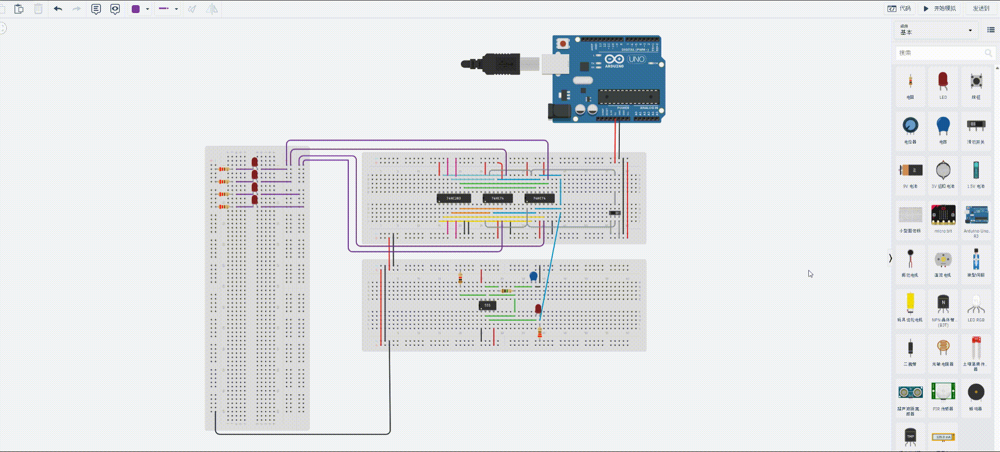

# 总线

上个章节用 74HC283（4 位加法器）+ 74HC74（双 D 触发器）搭了一个累加器，输出结果用 4 个 LED 来展示。但随着电路扩大，输出结果需要接向更多其他元件，面包板上的孔就不够了。

我们需要把输出结果统一到**一条公共通路上**，想使用输出结果的其他元件都接到这条路上就行——这条路就叫**总线**。

这是把 4 位加法结果输出到总线上，这个总线是 **4 位总线**。面包板两侧的电源路孔是很多的：

现在元件还比较少，等到后续模块越来越多了，就能更能体现总线的用处了。