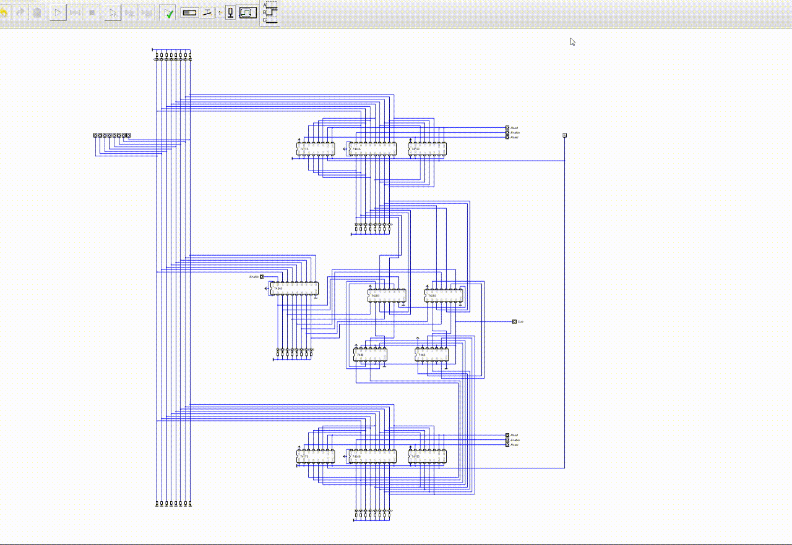

# 8 位 ALU（运算器）

前面几章已经把存储器升级到 8 位寄存器了，现在该升级**运算器（ALU）**：

1. 支持 8 位运算
2. 支持减法

## 设计思路

回想之前的 4 位加法器：2 个 4 位输入、1 个进位输入、1 个进位输出、1 个 4 位输出。现在升级为：

- **2 个 8 位输入**、1 个进位输入、1 个进位输出、**1 个 8 位输出**
- 增加 **Enable** 控制 8 位输出是否直接输出到总线
- 增加 **SUB** 引脚控制是否计算减法

## 减法的实现（SUB 控制）

根据上节的结论，二进制减法可以简化为：

```
被减数 − 减数 = 被减数 +（减数的反码）+ 1
```

所以加法器的 B 输入不直接接寄存器 B，而是接 **寄存器 B 与 SUB 的异或结果**：

```
寄存器B ──┐
          ├── 异或门(7486) ── 加法器B输入
SUB ──────┘
```

同时 SUB 还接到低位加法器的进位输入 CI。原理：

| SUB | 异或输出 | CI | 计算 |
|:---:|:-------:|:---:|:----:|
| 0 | B（不变） | 0 | 加法 A + B |
| 1 | ~B（取反） | 1 | 减法 A − B = A + ~B + 1 |


## 电路结构（Digital 仿真）

改用仿真效果更好的 **Digital** 画图：

- **74LS245**：加法器输出缓存区（控制是否输出到总线）
- **2 × 74LS283**：串联成 8 位加法器
- **2 × 74LS86**：异或门（做减法取反）
- 加法器 A 输入 ← 寄存器 A
- 加法器 B 输入 ← 寄存器 B 与 SUB 的异或结果
- SUB 线同时接低位加法器的 CI


## 面包板实物

之前总线右侧有两块面包板（上面是寄存器 A，下面是寄存器 B），现在为了方便接线，在寄存器 A 下面加了一块面包板：

**ALU 面包板（寄存器 A 下面）：**
- 左侧是 74LS245：DIR 接 VCC，**B1-B8 作为输入**（接两个 74LS283 的输出），B1-B8 并联 8 个 LED 展示输出；A1-A8 接总线，由 Enable 引脚控制是否输出
- B1-B8 接两个 74LS283 的输出引脚
- 寄存器 A 的输出引脚再拉线接 74LS283 的 A 输入

**再下面一块面包板（两个 74LS86）：**
- 每个异或门的一个输入接 SUB，并与上面面包板右边的 74LS283 的 CI 相连
- 另一个输入接寄存器 B
- 异或门输出接到两个 74LS283 的 B 输入

> ⚠️ **位序注意**（不同芯片高低位约定相反）：
> - 74LS283：A1、B1 是低位，A4、B4 是高位
> - 74LS173：Q1、D1 是高位，Q4、D4 是低位
> - 74LS245：B1 是高位，B8 是低位
> - 接线时不能简单一一对应，注意高低位别接反

## 实测 1：加法 7 + 3 = 10

二进制：`111 + 11 = 1010`

通过总线左侧的 8 位 DIP 开关设置总线为 `0000 0111` 和 `0000 0011`，让寄存器 A、B 分别读取，ALU 自动计算，LED 显示 `0000 1010`：


## 实测 2：减法 1 − 5 = −4

二进制：`0000 0001 − 0000 0101 = 1111 1100`

通过 DIP 设置总线为 `0000 0001` 和 `0000 0101` 让寄存器 A、B 分别读取，然后设置 SUB 接 VCC，ALU 的 LED 显示 `1111 1100`。

验证负数：最高位符号位不变，其余位取反后整体加 1：

```
1111 1100 → 取反 1000 0011 → +1 → 1000 0100 = −4 ✅
```


## 实测 3：计数器

将寄存器 A 置为 `0000 0001` 后关闭读。寄存器 B 一直读取总线的值，ALU 一直输出到总线：

```
初始：B = 0000 0000，ALU = 0000 0001
B 读取总线 → 1，ALU 计算 → 0000 0010
B 又读取 → 0000 0010，ALU 计算 → 0000 0011
...（依次递增）
```

面包板实物视频：

<video controls src="../images/07-alu/alu-counter-breadboard.mp4" title="计数器面包板实物"></video>

Digital 仿真动图：

